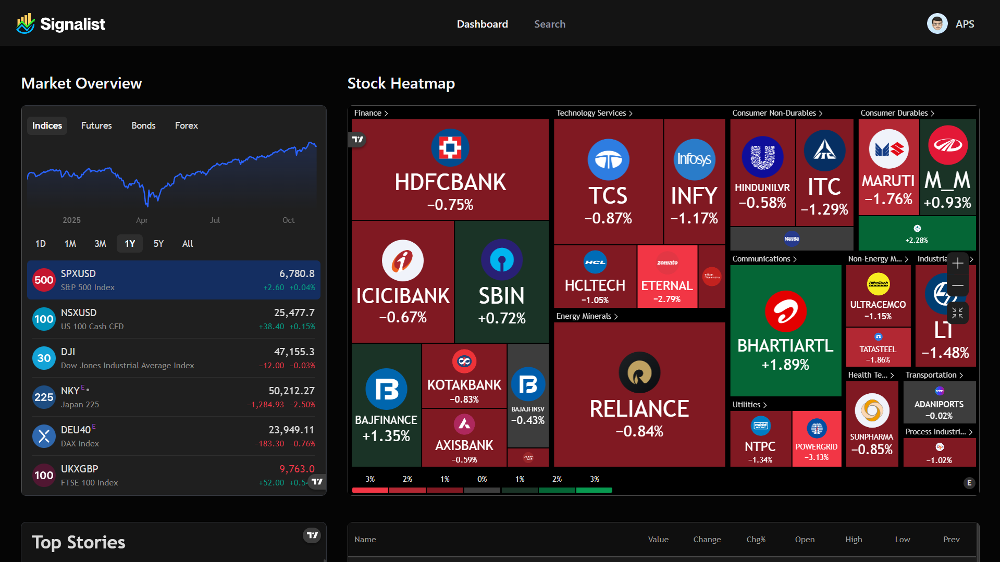

<div align="center">
  
  
  # 📈 Real-time Stock Tracker
  
  ### Track Indian Stock Market in Real-Time with Advanced Analytics
  
  [](https://nextjs.org/)
  [](https://reactjs.org/)
  [](https://www.typescriptlang.org/)
  [](https://www.mongodb.com/)
  [](https://tailwindcss.com/)

[Demo](#demo) • [Features](#features) • [Installation](#installation) • [Usage](#usage) • [Tech Stack](#tech-stack)

</div>

## 📸 Demo

<div align="center">
  
  <p><em>Real-time Indian Stock Market Dashboard with Interactive Charts</em></p>
</div>

## ✨ Features

### 🎯 Core Features

- **Real-time Stock Data** - Live prices and market data for Indian stocks (NSE/BSE)
- **Interactive TradingView Charts** - Professional-grade candlestick, baseline, and technical analysis charts
- **Market Overview** - Comprehensive dashboard with heatmaps and market quotes
- **Stock Search** - Powerful search functionality to find Indian stocks instantly
- **Watchlist Management** - Create and manage your personalized stock watchlist
- **Company Insights** - Detailed company profiles and financial data

### 📊 Market Analytics

- **Technical Analysis** - Real-time technical indicators and analysis
- **Company Financials** - Balance sheets, income statements, and key metrics
- **Market Heatmap** - SENSEX sector visualization with performance tracking
- **News Feed** - Latest market news and company-specific updates

### 🔐 User Features

- **Authentication** - Secure sign-up/sign-in with Better Auth
- **Personalized Experience** - Custom watchlists and preferences
- **Email Notifications** - Daily market summaries and news updates
- **User Profiles** - Investment goals, risk tolerance, and preferred industries

### 🎨 UI/UX

- **Dark Mode** - Modern, eye-friendly dark theme
- **Responsive Design** - Optimized for desktop, tablet, and mobile
- **Keyboard Shortcuts** - Quick access with Cmd/Ctrl + K
- **Beautiful Components** - Built with Radix UI and Shadcn/ui

## 🚀 Tech Stack

### Frontend

- **[Next.js 15.5.4](https://nextjs.org/)** - React framework with App Router
- **[React 19.1.0](https://reactjs.org/)** - UI library
- **[TypeScript](https://www.typescriptlang.org/)** - Type-safe JavaScript
- **[Tailwind CSS 4.0](https://tailwindcss.com/)** - Utility-first CSS framework
- **[Shadcn/ui](https://ui.shadcn.com/)** - Re-usable component library
- **[Radix UI](https://www.radix-ui.com/)** - Accessible component primitives

### Backend & Database

- **[MongoDB](https://www.mongodb.com/)** - NoSQL database
- **[Mongoose 8.19.1](https://mongoosejs.com/)** - MongoDB object modeling
- **[Better Auth 1.3.27](https://www.better-auth.com/)** - Modern authentication solution

### APIs & Integrations

- **[Finnhub API](https://finnhub.io/)** - Real-time stock market data
- **[TradingView Widgets](https://www.tradingview.com/widget/)** - Professional charting
- **[Inngest 3.44.3](https://www.inngest.com/)** - Background jobs and workflows
- **[Nodemailer 7.0.9](https://nodemailer.com/)** - Email notifications

### Development Tools

- **[ESLint](https://eslint.org/)** - Code linting
- **[Turbopack](https://turbo.build/pack)** - Next.js bundler
- **[Lucide Icons](https://lucide.dev/)** - Beautiful icon library

## 📦 Installation

### Prerequisites

- Node.js 20+ installed
- MongoDB database (local or cloud)
- Finnhub API key ([Get it here](https://finnhub.io/))
- Better Auth credentials

### Setup Steps

1. **Clone the repository**

```bash
git clone https://github.com/ateendra24/Realtime_Stock_Tracker.git
cd Realtime_Stock_Tracker
```

2. **Install dependencies**

```bash
npm install
# or
yarn install
# or
pnpm install
```

3. **Environment Configuration**

Create a `.env.local` file in the root directory:

```env
# MongoDB
MONGODB_URI=your_mongodb_connection_string

# Better Auth
BETTER_AUTH_SECRET=your_secret_key_here
BETTER_AUTH_URL=http://localhost:3000

# Finnhub API
FINNHUB_API_KEY=your_finnhub_api_key
NEXT_PUBLIC_FINNHUB_API_KEY=your_finnhub_api_key

# Inngest (Optional)
INNGEST_EVENT_KEY=your_inngest_event_key
INNGEST_SIGNING_KEY=your_inngest_signing_key

# Email (Optional - for notifications)
EMAIL_USER=your_email@gmail.com
EMAIL_PASS=your_email_app_password
```

4. **Test Database Connection**

```bash
npm run test:db
```

5. **Run the development server**

```bash
npm run dev
```

6. **Open your browser**

```
http://localhost:3000
```

## 🎮 Usage

### For Visitors (No Login Required)

1. **Browse Dashboard** - View real-time Indian market data
2. **Explore Stocks** - Search and view individual stock details
3. **View Charts** - Access TradingView charts and technical analysis

### For Registered Users

1. **Create Account** - Sign up with email and preferences
2. **Build Watchlist** - Add your favorite Indian stocks
3. **Set Alerts** - Configure price alerts (coming soon)
4. **Get Updates** - Receive daily market summaries via email

### Keyboard Shortcuts

- `Cmd/Ctrl + K` - Open stock search
- Navigate through stocks quickly with keyboard

## 📂 Project Structure

```
stock/
├── app/                      # Next.js App Router
│   ├── (auth)/              # Authentication pages
│   │   ├── sign-in/
│   │   └── sign-up/
│   ├── (root)/              # Main application
│   │   ├── page.tsx         # Dashboard
│   │   └── stocks/[symbol]/ # Stock details page
│   ├── api/                 # API routes
│   └── layout.tsx           # Root layout
├── components/              # React components
│   ├── ui/                  # Shadcn/ui components
│   ├── forms/               # Form components
│   ├── Header.tsx
│   ├── SearchCommand.tsx
│   └── TradingViewWidget.tsx
├── lib/                     # Utilities and actions
│   ├── actions/             # Server actions
│   ├── better-auth/         # Auth configuration
│   ├── inngest/             # Background jobs
│   ├── nodemailer/          # Email templates
│   ├── constants.ts         # App constants
│   └── utils.ts             # Helper functions
├── database/                # Database models
│   ├── models/
│   └── mongoose.ts
├── hooks/                   # Custom React hooks
├── middleware/              # Next.js middleware
├── public/                  # Static assets
└── types/                   # TypeScript definitions
```

## 🌟 Key Features Explained

### 1. **Indian Stock Market Focus**

- Supports NSE (National Stock Exchange) and BSE (Bombay Stock Exchange)
- 45+ popular Indian stocks across all sectors
- SENSEX heatmap visualization
- Indian market news feed

### 2. **TradingView Integration**

Six professional widgets:

- Symbol Information
- Candlestick Chart
- Baseline Chart
- Technical Analysis
- Company Profile
- Financial Statements

### 3. **Smart Authentication**

- Public access to dashboard and stock pages
- Seamless sign-in/sign-up experience

### 4. **Background Jobs with Inngest**

- Automated daily news summaries
- Personalized email notifications
- Welcome emails for new users

## 🔧 Available Scripts

```bash
# Development
npm run dev          # Start development server with Turbopack

# Production
npm run build        # Build for production
npm start            # Start production server

# Utilities
npm run lint         # Run ESLint
npm run test:db      # Test database connection
```

## 🤝 Contributing

Contributions are welcome! Please feel free to submit a Pull Request.

1. Fork the project
2. Create your feature branch (`git checkout -b feature/AmazingFeature`)
3. Commit your changes (`git commit -m 'Add some AmazingFeature'`)
4. Push to the branch (`git push origin feature/AmazingFeature`)
5. Open a Pull Request

## 📝 Environment Variables

| Variable             | Description               | Required    |
| -------------------- | ------------------------- | ----------- |
| `MONGODB_URI`        | MongoDB connection string | ✅ Yes      |
| `BETTER_AUTH_SECRET` | Secret key for auth       | ✅ Yes      |
| `BETTER_AUTH_URL`    | Application URL           | ✅ Yes      |
| `FINNHUB_API_KEY`    | Finnhub API key           | ✅ Yes      |
| `INNGEST_EVENT_KEY`  | Inngest event key         | ❌ Optional |
| `EMAIL_USER`         | Email for notifications   | ❌ Optional |
| `EMAIL_PASS`         | Email password            | ❌ Optional |

---

⭐ Star this repo if you find it helpful!
